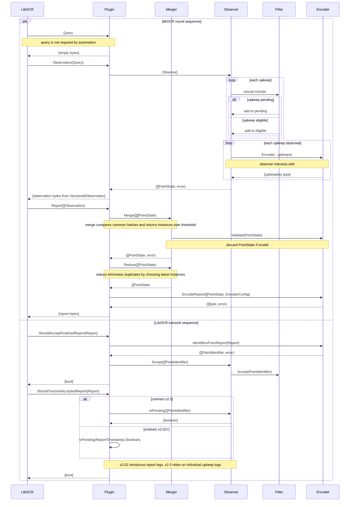

# Automation LibOCR Plugin Flow Diagram

**Open Questions**
- Does LibOCR leverage compression on message delivery?
- Would it be helpful to implement data compression on observations or reports?

## Observer
An `Observer` evaluates upkeep state from a chain registry and collects upkeeps
that need to be performed along with data required for comparison and reporting.

Examples can include:
- polling observer (polls the chain at each block)
- log trigger observer (logs can trigger observations)
- scheduled observer (polling occurs on a defined schedule like cron)

### Filter
A `Filter` tracks the pending state of upkeeps from the perspective of a single
node. Once an upkeep is accepted into a report, the filter should indicate
that upkeep as pending until a completion log is encountered or after a lockout
window. A `Filter` should be directly paired with an `Observer` as they work in
tandem to ensure accurate observations. The `Plugin` should never interact 
directly with a `Filter`.

## Encoder
An `Encoder` is responsible for encoding/decoding upkeeps, observation points, 
performable results, etc. since each of these concepts are simply wrappers for
byte arrays. The `Plugin` should never interact directly with these values
without using the `Encoder`. The encoder can provide interface types only when
comparisons are needed.

## Merger
A `Merger` provides methods to reduce individual parts from multiple observations
down to a simple list of validated, deduplicated, and counted 
(for quorum evaluation) values. Second, it provides a method to reduce a list
of eligibles by a list of pendings.

## Plugin
A `Plugin` provides methods for LibOCR to call as a valid OCR2 plugin. The 
responsibility of each method is defined below.

### Observation
The `Observation` method should loop through multiple `Observer` to collect
pending and eligible upkeep results. Those results should be packaged together
as an automation observation (distinct type) and byte encoded. This function
should never directly interact with the encoded upkeep results. Its sole
responsibilities should remain as a collector and basic encoder to the final
transport type.

#### Observation Struct
An observation is composed of a list of eligible upkeeps and a list of pending
upkeeps. Providing both allows for all nodes to produce a report without
checking internal state.

```
type VersionedObservation struct {
    Version string
    Observation interface{}
}

type ObservationV10 []PointState
```

### Report
A report should be able to be constructed without ever checking internal state.
All observations should be fully validated independently, merged together, and 
reduced by provided pending state structs. The result should be entirely 
stateless.

### Should Accept
When a report interacts with the `Filter`, the final result is an encoded 
pending state change. This is required by the observer to provide all valid
pending upkeep structs. 

