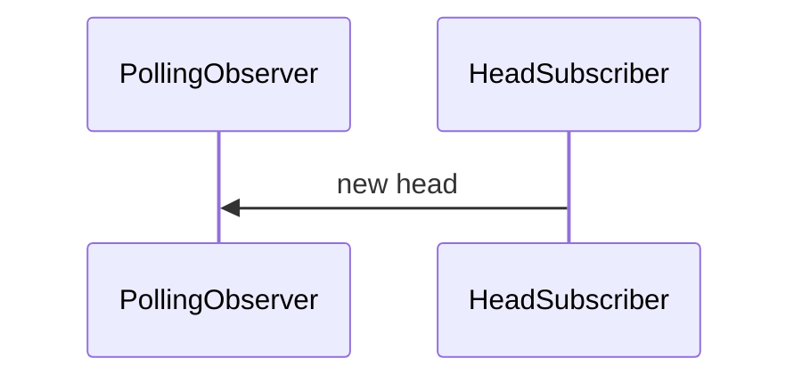

# Generic Observer
An `Observer` evaluates upkeep state from a chain registry and collects upkeeps
that need to be performed along with data required for comparison and reporting.

Examples can include:
- polling observer (polls the chain at each block)
- event trigger observer (logs can trigger observations)
- scheduled observer (polling occurs on a defined schedule like cron)

## Observer Rules
- an observer should be chain agnostic
- an observer should interact with a registry through a wrapper
- an observer can define its own dependency interfaces
- an observer should track relevant upkeep pending state
- an observer can have registry specific structures
- all observers used by the same plugin instance should use the same registry

## Filter
A `Filter` tracks the pending state of upkeeps from the perspective of a single
node. Once an upkeep is accepted into a report, the filter should indicate
that upkeep as pending until a completion log is encountered or after a lockout
window. A `Filter` should be directly paired with an `Observer` as they work in
tandem to ensure accurate observations. The `Plugin` should never interact 
directly with a `Filter`.

## Interface
An `Observer` provides two functions as described in the following interface.

```
type Observer interface {
    Observe() ([]PointState, error)
    Accept([]PointIdentifier) error
}
```

# Polling Observer
The polling observer is a specific implementation of an `Observer` that polls a
chain through a registry every block. To reduce workload, the polling observer
limits the number of upkeeps check based on a sampling ratio.

## Ratio
The sampling ratio is determined by the probability that all upkeeps will be
observed by at least `n` nodes over `x` number of blocks.

