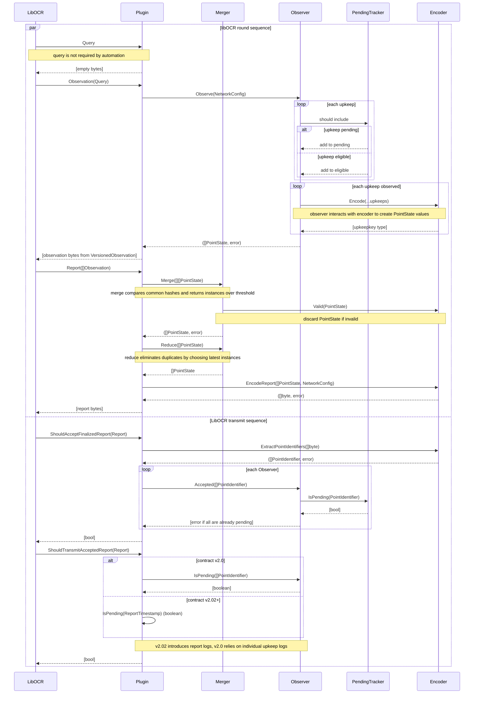

# Automation LibOCR Plugin Flow Diagram

```mermaid
sequenceDiagram
    participant LibOCR
    participant Plugin
    participant Merger
    participant Observer
    participant PendingTracker
    participant Encoder

    par libOCR round sequence
        LibOCR->>Plugin: Query
        Note over LibOCR,Plugin: query is not required by automation
        Plugin-->>LibOCR: [empty bytes]
        LibOCR->>Plugin: Observation(Query)
        Plugin->>Observer: Observe(NetworkConfig)

        loop each upkeep
            Observer->>PendingTracker: should include
            alt upkeep pending
                PendingTracker-->>Observer: add to pending
            else upkeep eligible
                PendingTracker-->>Observer: add to eligible
            end
        end

        loop each upkeep observed
            Observer->>Encoder: Encode(...upkeeps)
            Note over Observer,Encoder: observer interacts with encoder to create PointState values
            Encoder-->>Observer: [upkeepkey type]
        end

        Observer-->>Plugin: ([]PointState, error)
        Plugin-->>LibOCR: [observation bytes from VersionedObservation]
        
        LibOCR->>Plugin: Report([]Observation)
        Plugin->>Merger: Merge([][]PointState)
        Note over Plugin,Merger: merge compares common hashes and returns instances over threshold
        Merger->>Encoder: Valid(PointState)
        Note over Merger,Encoder: discard PointState if invalid
        Merger-->>Plugin: ([]PointState, error)

        Plugin->>Merger: Reduce([]PointState)
        Note over Plugin,Merger: reduce eliminates duplicates by choosing latest instances
        Merger-->>Plugin: []PointState

        Plugin->>Encoder: EncodeReport([]PointState, NetworkConfig)
        Encoder-->>Plugin: ([]byte, error)

        Plugin-->>LibOCR: [report bytes]
    and LibOCR transmit sequence
        LibOCR->>Plugin: ShouldAcceptFinalizedReport(Report)
        
        Plugin->>Encoder: ExtractPointIdentifiers([]byte)
        Encoder-->>Plugin: ([]PointIdentifier, error)

        loop each Observer
            Plugin->>Observer: Accepted([]PointIdentifier)
            Observer->>PendingTracker: IsPending(PointIdentifier)
            PendingTracker-->>Observer: [bool]
            Observer-->>Plugin: [error if all are already pending]
        end

        Plugin-->>LibOCR: [bool]

        LibOCR->>Plugin: ShouldTransmitAcceptedReport(Report)
        alt contract v2.0
            Plugin->>Observer: IsPending([]PointIdentifier)
            Observer-->>Plugin: [boolean]
        else contract v2.02+
            Plugin->>Plugin: IsPending(ReportTimestamp) (boolean)
        end
        Note over Plugin,Observer: v2.02 introduces report logs, v2.0 relies on individual upkeep logs
        Plugin-->>LibOCR: [bool]
    end
```