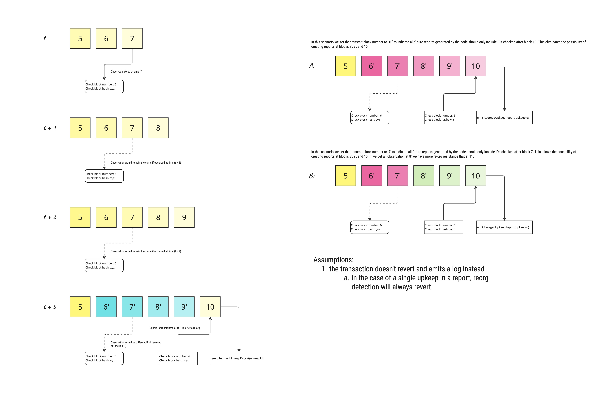

# Coordinator

The coordinator is a component which keeps track of in-flight reports for (triggerID, upkeepID). The coordinator is notified when a new report is created to store it in memory until report is confirmed and marked as done.
Entries in coordinator will expire after a pre-configured TTL.

Coordinator is being queried in the following scenarios:

1. Within the transmission protocol: When a node gets its preconfigured turn within the transmission protocol, it checks the coordinator whether the report is still pending and if so attempts to transmit the report.

2. During conditional upkeeps pre-processing / post-processing steps, we avoid creating a new report for the same upkeep while one is in progress. 
It allows to ensure that a new report is created only after the previous one has been confirmed.

3. During log upkeeps pre-processing step, we check that recoverable upkeeps are not in progress already.

