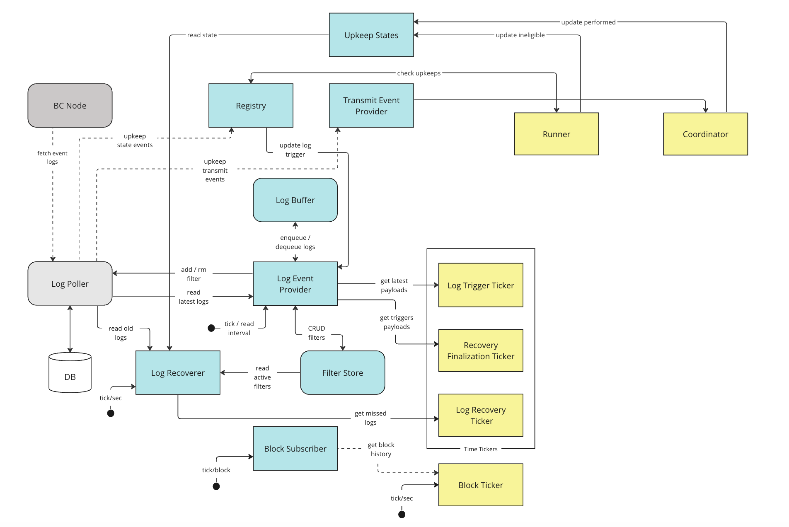
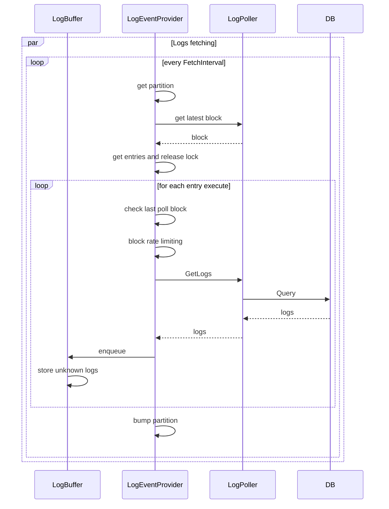
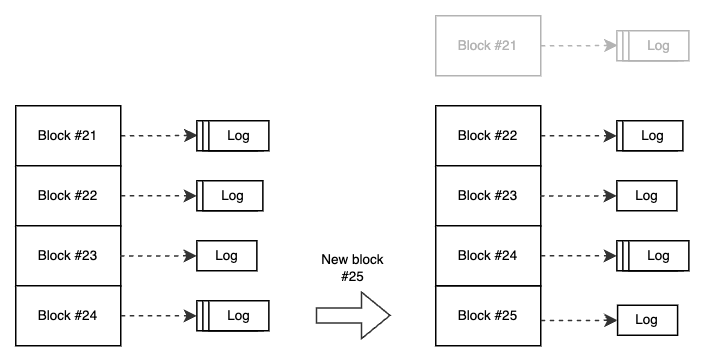

# Log Event Provider

This document describes the log event provider, which is responsible for fetching logs of active log upkeeps, and exposing them to the log observer (pre processor).

## Overview

The log event provider fetches logs from log poller, 
and stores them in the log buffer, which exposes them to the 
log observer (pre processor).

In addition, the provider also manages the log filters life-cycle. 

The following block diagrams describes the involved components:

**TODO:** use miro diagram

 

### Log Filters Life-Cycle

Upon registration or unpausing of an upkeep, the provider registers the corresponding filter in `LogPoller`, while upon canceled or paused upkeep we unregister the filter to avoid overloading the DB with redundant filters.

**TBD: unfunded upkeeps**

For each relevant state event, the provider will get the actual config from the contract and update the filter accordingly. 
We don't rely on the log event as it is unfinalized.

 

### Fetching Logs

Logs fetching in done continouosly in the background.
Every `FetchInterval` it fetches logs for a subset of the active log upkeeps,
which is determined by `FetchPartitions`. We do hash partitioning, where every contract address of upkeep filter (can be shared among multiple upkeeps) is hashed and the hash is used to determine the partition, only 6 bytes are used to avoid working with large numbers : \
`sha256(contractAddr)[:6] % FetchPartitions`

i.e. `len(activeLogUpkeeps)/FetchPartitions` 
upkeeps are queried every `FetchInterval`.

Once fetched, logs are stored in the log buffer.

The following sequence diagram describes the flow:

 

#### Blocks Range

Upon initial fetch/restart, we ask for `LogBlocksLookback` blocks.
Afterwards, each upkeep has a `lastPollBlock` assiciated with it so we can continue next fetch from the same point.
The actual range that is passed to log poller will be extended with `LookbackBuffer` to catch reorgs.

#### Rate Limiting

Each upkeep has a rate limiter for blocks in order to control the amount of queries per upkeep, `BlockRateLimit` and `BlockLimitBurst` are used to configure the limit.

Upon initial fetch/restart the burst is automatically increased as we ask for `LogBlocksLookback` blocks.

**TBD** additional limiting of logs to check per upkeep should be done either on the provider side or the observer.

#### Log Retention

Logs are saved in DB for `LogRetention` amount of time.

 

### Log Buffer

A circular/ring buffer of fetched logs.
Each entry in the buffer represents a block, and holds the logs fetched for that block. The block number is calculated as `blockNumber % LogBufferSize`.

We limit the amount of logs per block with `AllowedLogsPerBlock`, while the number of blocks (`LogBufferSize`) is currently set as `LogBlocksLookback*3` to have enough space.

No cleanup of data is needed, new blocks will override older blocks. 
In addition to new log events, each block holds history of the logs that were dequeued, in order to filter out duplicates.

The log buffer is implemented with capped slice that is allocated upon buffer creation or restart, and a rw mutex for thread safety.

 

## Rational

### Why not use go-cache for log buffer?

We have a logical cache clock (block number) that is used to determine the oldest block in the buffer, using time based cache will require additional goroutine behind the scenes to clean up the cache while acquiring a lock on the cache.

In addition, we need to be able to query logs by a range of block numbers. 
`go-cache` requires to loop the entire map or to do multiple reads, where each read will require a lock.
A one-time allocated slice is more efficient in this case over a map, and allows us to query logs by a range of blocks in a single read.

### Why we use contract address for partitioning?

Patitioning by contract address will group the filters of the same contract together, allowing us to optimize the queries to the DB.

### Why not use consistent hashing for partitions when fetching logs?

consistent hashing is not used since we don't need to have stable partitioning between multiple fetches.

### Why not fetching logs for all active upkeeps in a single procedure?

We want to avoid overloading the DB with large amount of queries.
batching the queries into smaller chunks allows us to balance our interaction with the DB.