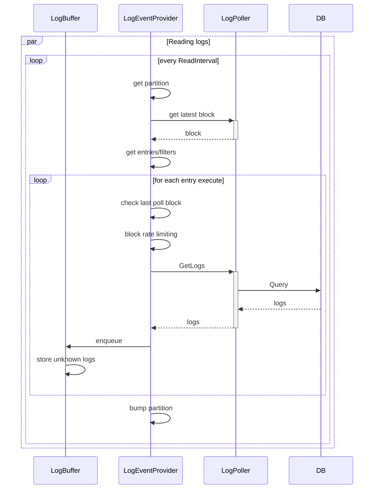

# Log Event Provider

This document describes the log event provider, which is the data source for log triggers. \
The provider is responsible for reading logs of active log upkeeps from log poller, 
and exposing them to the log observer.

## Overview

The provider reads logs from log poller, 
and stores them in the log buffer, which will be queried by the 
log observer (pre processor) for latest logs w/o input, i.e. with no range or any indication for desired upkeeps.

In addition, the provider also manages the log filters life-cycle. 

The following block diagram describes the involved components:

 

### Log Filters Life-Cycle

Upon registration or unpausing of an upkeep, the provider registers the corresponding filter in `LogPoller`, while upon canceled or paused upkeep we unregister the filter to avoid overloading the DB with redundant filters.

**TBD: unfunded upkeeps**

For each relevant state event, the provider will get the actual config from the contract and update the filter accordingly. 
We don't rely on the log event as it is unfinalized.

 

### Reading Logs from DB

The provider reads logs from the log poller continouosly in the background and stores them in the [log buffer](#log-buffer).

Every `ReadInterval` the provider reads logs for `ReadMaxBatchSize` active log upkeeps.

Hash partitioning is done on the contract address of the filters.
The address can be shared among multiple upkeeps. 
Only the last 6 bytes of the hash are used to avoid working with large numbers, assuming that the number of partitions won't exceed 5 digits: \
`sha256(filter.contractAddr)[(len-6):] % Partitions`

**NOTE:** we count on the hash function 
to provide balanced distribution of addresses.

The number of partitions (`Partitions`) is dynamically changing 
according to the number of active upkeeps: \
`Partitions = len(activeUpkeeps) / ReadMaxBatchSize`

It is guarteed that all upkeeps will be visited once within one round time frame which is `ReadInterval*Partitions`.

The following sequence diagram describes the flow:

 

#### Blocks Range

Upon initial read/restart, we ask for `LogBlocksLookback` blocks, i.e. range of `[latestBlock-LogBlocksLookback, latestBlock]`.

After initialization, each upkeep has a `lastPollBlock` assiciated with it so we can continue next read from 
the same point with some buffer to catch reorgs: `[u.lastPollBlock-LookbackBuffer, latestBlock]`

#### Rate Limiting

Each upkeep has a rate limiter for blocks in order to control the amount of queries per upkeep, i.e. to control the number of blocks that are queried from log poller. `BlockRateLimit` and `BlockLimitBurst` are used to configure the limit.

Upon initial read/restart the burst is automatically increased as we ask for `LogBlocksLookback` blocks.

Besides the number of blocks, we limit the amount of logs we process per upkeep in a block with `AllowedLogsPerBlock` that in configured in the buffer (see [Log Buffer](#log-buffer)).

**TBD** additional limiting of upkeep-checks/sec rate

#### Log Retention

Logs are saved in DB for `LogRetention` amount of time. 

**NOTE:** managed by the log poller, each filter holds a retention field.

 

### Log Buffer

A circular/ring buffer of blocks and their corresponding logs.
The block number is calculated as `blockNumber % LogBufferSize`.

We limit the amount of logs per block with `BufferMaxBlockSize`, and logs per block & upkeep with `AllowedLogsPerBlock`. While the number of blocks `LogBufferSize` is currently set as `LogBlocksLookback*3` to have enough space.

No cleanup of data is needed, new blocks will override older blocks. 
In addition to new log events, each block holds history of the logs that were dequeued, in order to filter out duplicates. 
We compare logs by their block number, hash, tx hash and log index. the rest of the fields are ignored to reduce memory footprint.
In case of multiple upkeeps with the same filter, we will have multiple entries in the buffer for the same log.

The log buffer is implemented with capped slice that is allocated upon buffer creation or restart, and a rw mutex for thread safety.

 

## Configuration

The following configurations are used by the log event provider:

**TBD:** Chain specific defaults

| Config | Description | Default |
| --- | --- | --- |
| `LogBlocksLookback` | Number of blocks to read upon initial read/restart | `512` |
| `LogRetention` | Time to keep logs in DB | `24hr` |
| `LogBufferSize` | Number of blocks to keep in buffer | `LogBlocksLookback*3` |
| `BufferMaxBlockSize` | Max number of logs per block | `1000` |
| `AllowedLogsPerBlock` | Max number of logs per block & upkeep | `100` |
| `ReadInterval` | Interval between reads | `1s` |
| `ReadMaxBatchSize` | Max number of items in one read batch / partition | `100` |
| `LookbackBuffer` | Number of blocks to add to the range | `32` |
| `BlockRateLimit` | Max number of blocks to query per upkeep | `1/sec` |
| `BlockLimitBurst` | Burst of blocks to query per upkeep | `128` |

 

## Open Issues / TODOs

- [ ] Unfunded upkeeps - currently we keep the filter in log poller, 
but we don't read logs for it. The filter should be removed from log poller after some time
to avoid overloading the poller with redundant filters.
- [ ] Simplify/abstract configurations and add chain specific defaults
- [ ] Missed logs - there might be edge cases where some logs are missed, 
while the provider is not in control e.g. high DB latency.
One option to mitigate these cases is to have additional thread that continuously tries to fill the gaps by reading logs from the DB and adding them to the buffer.
- [ ] Dropped logs - in cases of fast chains or slow OCR rounds we might need to drop logs.
The buffer size can be increased to allow bursting, but if the consumer (OCR) is slow for a while then some logs might be dropped.
- [ ] Call log poller once per contract address - currently the filters are grouped by contract address, but we call log poller for each upkeep separately. 
One option is to call log poller once per contract address, and filter the results "manually". Another option is to implement this kind of logic within log poller.

## Rational / Q&A

### How are changes to active log upkeeps handled between two read intervals

In case some upkeep was removed we drop it from active upkeeps, and it won't be included in future reads. In case it was removed while being in reading process we might loose these logs.

In case some upkeep was changed, we will update the filter in log poller, and it will be included in future reads. But the last poll block remains the same, so the change will take effect only after the next read.

### Why not use go-cache for log buffer?

We have a logical cache clock (block number) that is used to determine the oldest block in the buffer, using time based cache will require additional goroutine behind the scenes to clean up the cache while acquiring a lock on the cache.

In addition, we need to be able to query logs by a range of block numbers. 
`go-cache` requires to loop the entire map or to do multiple reads, where each read will require a lock.
A one-time allocated slice is more efficient in this case over a map, and allows us to query logs by a range of blocks in a single read.

### Why we use contract address for partitioning?

Patitioning by contract address will group the filters of the same contract together, allowing us to optimize the queries to the DB.

### Why not use consistent hashing for partitions when reading logs?

The number of partitions is changing upon each interval, but since we don't need to have stable partitioning between multiple intervals, we can use a simple hash function. 

### Why not reading logs for all active upkeeps in a single procedure?

We want to avoid overloading the DB with large amount of queries.
batching the queries into smaller chunks allows us to balance our interaction with the DB.
