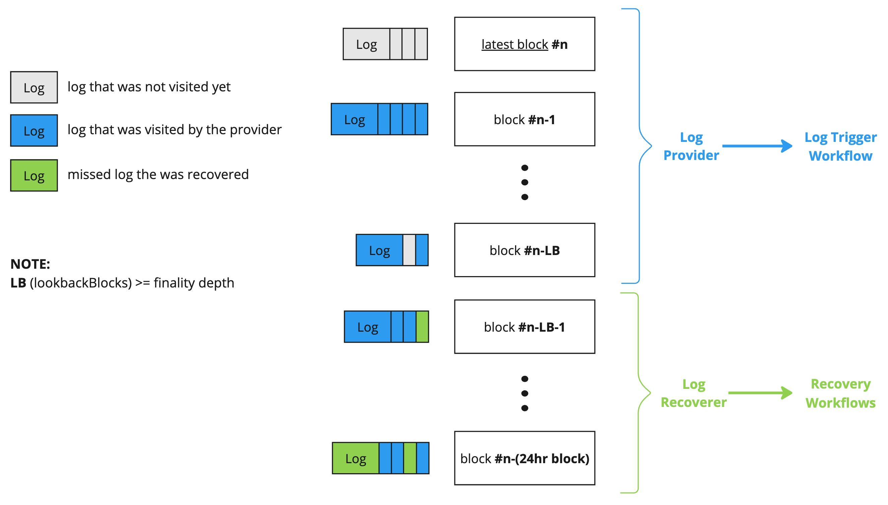
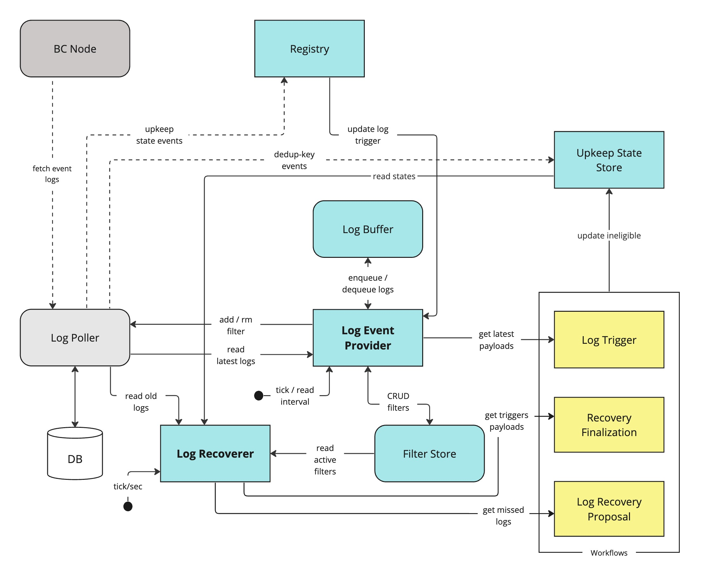
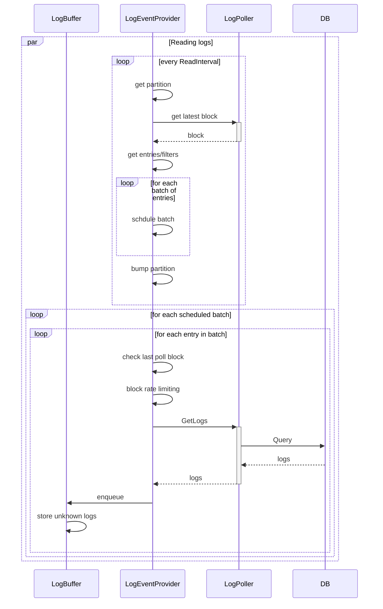

# EVM Log Triggers

This document describes the architecture and design of EVM log triggers.

 

## Table of Contents

- [Overview](#overview)
- [Log Event Provider](#log-event-provider)
    - [Reading Logs](#provider---reading-logs-from-db)
    - [Blocks Range](#blocks-range)
    - [Rate Limiting](#rate-limiting)
    - [Log Retention](#log-retention)
    - [Log Buffer](#log-buffer)
- [Log Recoverer](#log-recoverer)
- [Log Filters Life-Cycle](#log-filters-life-cycle)
- [Configuration](#configuration)
    - [Log Provider](#log-provider-config)
    - [Log Recoverer](#log-recoverer-config)
- [Open Issues / TODOs](#open-issues--todos)
- [Rational / Q&A](#rational--qa)

 

## Overview

Logs needs to be fetched and used as input data for log upkeeps pipeline.

The log poller is responsible for fetching & storing logs event in a DB, and expose them to other services within the node, based on registered log filters.

There are 2 seperate components that are responsible for reading logs, each runs on a separate thread:

The **log event provider** is responsible for reading latest logs from the poller,
and storing them in the **log buffer** for future processing as part of the log trigger flow.

The **log recoverer** is responsible for reading older logs, to do rescanning and pick up logs that were missed by the log event provider.

The following block diagram describes the block window for each component,
shown as a snapshot of blocks and their corresponding logs:

The following diagram describes the major components and their interactions:

<aside>
💡 Note: source is available in https://miro.com/app/board/uXjVPntyh4E=/
</aside>

 

<aside>
💡 Note: Arrows in the diagrams are directed by data flow.
</aside>

 

## Log Event Provider

The provider reads logs from log poller, 
and stores them in the log buffer, which will be queried by the 
log observer (pre processor) for latest logs w/o input, i.e. with no range or any indication for desired upkeeps.
The buffer ensures that logs will be kept for a certain amount of time, and to be visited/seen only once.

In addition, the provider also manages the log filters life-cycle. 

### Provider - Reading Logs from DB

The provider reads logs from the log poller continouosly in the background and stores them (once per upkeep+log pair) in the [log buffer](#log-buffer).

Every `ReadInterval` the provider reads logs for `ReadMaxBatchSize` active log upkeeps.

Hash partitioning is done on the contract address of the filters.
The address can be shared among multiple upkeeps. 
Only the last 6 bytes of the hash are used to avoid working with large numbers, assuming that the number of partitions won't exceed 5 digits: \
`sha256(filter.contractAddr)[(len-6):] % Partitions`

**NOTE:** we count on the hash function 
to provide balanced distribution of addresses.

The number of partitions (`Partitions`) is dynamically changing 
according to the number of active upkeeps: \
`Partitions = len(activeUpkeeps) / ReadMaxBatchSize`

It is guarteed that all upkeeps will be visited once within one round time frame which is `ReadInterval*Partitions`.

The following sequence diagram describes the flow:

 

#### Blocks Range

Upon initial read/restart, we ask for `LookbackBlocks` blocks, i.e. range of `[latestBlock-LookbackBlocks, latestBlock]`.

After initialization, each upkeep has a `lastPollBlock` assiciated with it so we can continue next read from 
the same point with some buffer to catch reorgs: `[u.lastPollBlock-LookbackBuffer, latestBlock]`

#### Rate Limiting

There are two levels of rate limiting:

**Blocks/queries**

Each upkeep has a rate limiter for blocks in order to control the amount of queries per upkeep, i.e. to control the number of blocks that are queried from log poller. `BlockRateLimit` and `BlockLimitBurst` are used to configure the limit.

Upon initial read/restart the burst is automatically increased as we ask for `LookbackBlocks` blocks.

Besides the number of blocks, we limit the amount of logs we process per upkeep in a block with `allowedLogsPerBlock` that in configured in the buffer (see [Log Buffer](#log-buffer)).

**Upkeep**

Each upkeep has a rate limiter for logs, where we limit the number of logs we read per upkeep. `UpkeepLogsLimit` is used to configure the limit.

#### Log Retention

Logs are saved in DB for `LogRetention` amount of time. 

**NOTE:** managed by the log poller, each filter holds a retention field.

 

### Log Buffer

A circular/ring buffer of blocks and their corresponding logs.
The block number is calculated as `blockNumber % LogBufferSize`.

We limit the amount of logs per block with `BufferMaxBlockSize`, and logs per block & upkeep with `AllowedLogsPerBlock`. While the number of blocks `LogBufferSize` is currently set as `LookbackBlocks`.

No cleanup of data is needed, new blocks will override older blocks. 
In addition to new log events, each block holds history of the logs that were dequeued, in order to filter out duplicates. 
We compare logs by their block number, hash, tx hash and log index. the rest of the fields are ignored to reduce memory footprint.
In case of multiple upkeeps with the same filter, we will have multiple entries in the buffer for the same log.

The log buffer is implemented with capped slice that is allocated upon buffer creation or restart, and a rw mutex for thread safety.

 

## Log Recoverer

The log recoverer is responsible to ensure that no logs are missed.
It does that by running a background process for re-scanning of logs and putting the ones we missed into the recovery flow (without checkBlockNum/Hash).

Logs will be considered as missed if they are older than `latestBlock - LookbackBlocks` and has not been performed or successfully checked already (eligible).

While the provider is scanning latest logs, the recoverer is scanning older logs in ascending order, starting from `latestBlock-24h` up to `latestBlock - LookbackBlocks`, newer blocks will be under the provider's lookback window.

**Recovery scanning process**

- The recoverer maintains a `lastRePollBlock` for each upkeep, .i.e. the last block it scanned for that upkeep.
- Every second, the recoverer will scan logs for a subset of `n=10` upkeeps, where `n/2` upkeeps are randomly chosen and `n/2` upkeeps are chosen by the oldest `lastRePollBlock`.
- It will start scanning from `lastRePollBlock` on each iteration, and update the block number when it finishes scanning.
- Logs that are older than 24hr are ignored, therefore `lastRePollBlock` starts at `latestBlock - (24hr block)` in case it was not populated before.
- The recoverer will query upkeep states to check if the upkeep was already performed or is currently inflight, and the log buffer to check if we read the log already.

 

## Log Filters Life-Cycle

Upon registration or unpausing of an upkeep, the provider registers the corresponding filter in `LogPoller`, while upon canceled or paused upkeep we unregister the filter to avoid overloading the DB with redundant filters.

In addition, the filters are maintained in the filter store - an in memory store of (active) filters. Both the recoverer and the provider read from the filter store, while the only the provider updates it.

In case of an **unfunded upkeep**, the filter is kept in log poller, but we don't read logs for it
(see [TBD](#open-issues--todos)) for more info).

In the future, migrated upkeeps might require to update the filter in log poller, 
therefore we first remove the old filter and then add the new one that was created post migration.
The same applies for config updates, where a new filter might be needed.

 

## Configuration

The following configurations are used by the log event provider:

| Name | Description | Default | Notes |
| --- | --- | --- | --- |
| `LookbackBlocks` | Number of blocks the provider will look back for logs. The recoverer will scan for logs up to this depth. while it's also the newest logs the recoverer reads. | `200` | Will be auto-set to be greater-or-equal to the chain's finality depth. |
| `ReadInterval` | Interval between provider reads | `1s` | |
| `BlockRateLimit` | Max number of blocks to query per upkeep | `1/sec` | |
| `BlockLimitBurst` | Burst of blocks to query per upkeep | `LookbackBlocks` | |

#### Log Provider Config

| Name | Description | Default | Notes |
|--|--|--|--|
| `logRetention` | Time to keep logs in DB | `24hr` | |
| `readMaxBatchSize` | Max number of items in one read batch / partition | `32` | |
| `reorgBuffer` | The number of blocks to add as a buffer to the block range when reading logs | `32` | |
| `allowedLogsPerUpkeep` | The number of logs allowed for upkeep per call to the provider | `5` | |

**Log Buffer**

| Name | Description | Default | Notes |
|--|--|--|--|
| `logBufferSize` | Number of blocks to keep in buffer | `LookbackBlocks` | |
| `bufferMaxBlockSize` | The maximum number of logs per block in the buffer | `1024` | |
| `allowedLogsPerBlock` | The maximum number of logs allowed per upkeep in a block | `128` | |

#### Log Recoverer Config

| Name | Description | Default | Notes |
|--|--|--|--|
| `recoveryInterval` | Interval between recoverer reads | `5s` | |
| `recoveryBatchSize` | Max number of items in one read batch | `10` | |
| `recoveryLogsBuffer` | The number of blocks to add as a buffer to the block range when reading logs | `50` | |

 

## Open Issues / TODOs

- [ ] Unfunded upkeeps - currently we keep the filter in log poller, 
but we don't read logs for it. The filter should be removed from log poller
to reduce workload of redundant filters. \
Unfunding is an horizontal problem for both log and condional upkeeps.
Current ideas are that unfunded upkeep will automatically get paused when we add offchain charge, 
so this component likely doesn't need to worry about it.
Another idea is to handle this on subscription level cross chainlink services.
- [ ] Dropped logs - in cases of fast chains or slow OCR rounds we might need to drop logs.
The buffer size can be increased to allow bursting, but if the consumer (OCR) is slow for a while then some logs might be dropped.
- [ ] Call log poller once per contract address - currently the filters are grouped by contract address, but we call log poller for each upkeep separately. 
One option is to call log poller once per contract address, and filter the results "manually". Another option is to implement this kind of logic within log poller.
- [ ] Buffer memory footprint - currently we keep the entire log per each upkeep in the buffer, while we can save logs per block and have additional collection of log references per upkeep, i.e. sort of an inverted index. 

 

## Rational / Q&A

### How are changes to active log upkeeps handled between two read intervals

In case some upkeep was removed we drop it from active upkeeps, and it won't be included in future reads. In case it was removed while being in reading process we might loose these logs.

In case some upkeep was changed, we will update the filter in log poller, and it will be included in future reads. But the last poll block remains the same, so the change will take effect only after the next read.

### Why not use go-cache for log buffer?

We have a logical cache clock (block number) that is used to determine the oldest block in the buffer, using time based cache will require additional goroutine behind the scenes to clean up the cache while acquiring a lock on the cache.

In addition, we need to be able to query logs by a range of block numbers. 
`go-cache` requires to loop the entire map or to do multiple reads, where each read will require a lock.
A one-time allocated slice is more efficient in this case over a map, and allows us to query logs by a range of blocks in a single read.

### Why we use contract address for partitioning?

Patitioning by contract address will group the filters of the same contract together, allowing us to optimize the queries to the DB.

### Why not use consistent hashing for partitions when reading logs?

The number of partitions is changing upon each interval, but since we don't need to have stable partitioning between multiple intervals, we can use a simple hash function. 

### Why not reading logs for all active upkeeps in a single procedure?

We want to avoid overloading the DB with large amount of queries.
batching the queries into smaller chunks allows us to balance our interaction with the DB.
