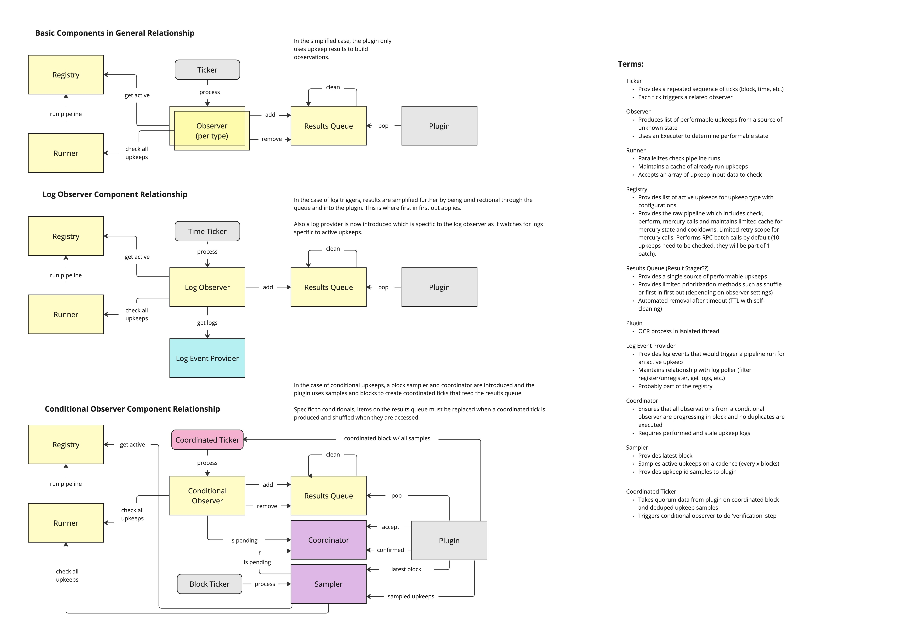

# Automation OCR3 Plugin

The design for the plugin in OCR3 is to separate components to allow for more
modularity in the plugin as new features are researched and added. Below is a 
block diagram that describes the general flow of upkeep data within automation
and provides examples of the different pathways for each current upkeep type.

## Coordinator

[Coordinator](./COORDINATOR.md)