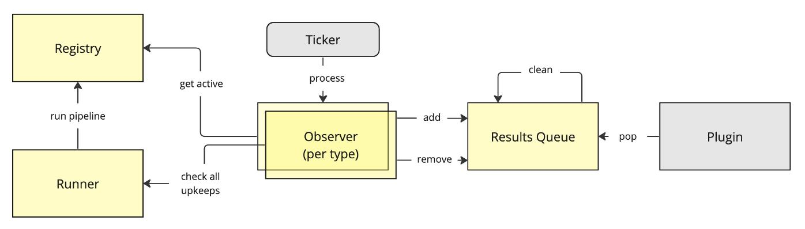
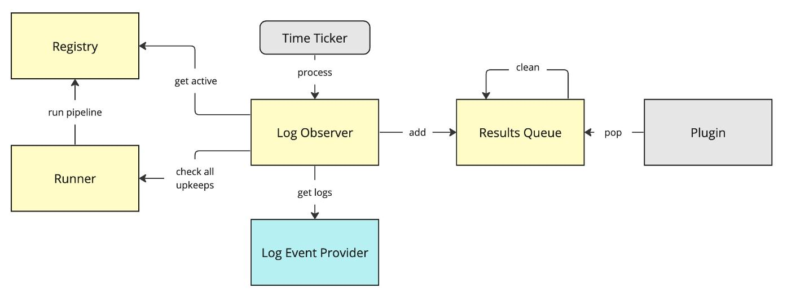
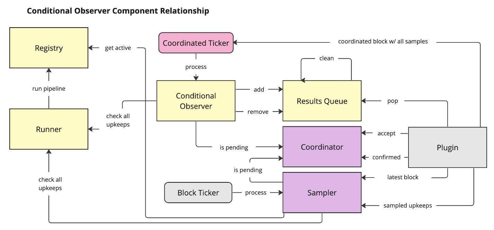

# Automation Plugin Overview

The following document describes the high level architecture of Autmation plugin (`v2.1`) for `OCR3`.

## Overview

The Automation plugin is designed to provide a way to automate smart contract interaction.

As part of the transition to `OCR3`, several components were separated to allow for more
modularity in the plugin as new features are researched and added, e.g. multiple trigger types.

 

### General Flow

Below is a block diagram that describes the general, simplified flow of upkeep data:

A sequence diagram can be found [here](./diagrams/generic_ticker_sequence.md)

The following components take part in the flow:

**Plugin** process OCR instances in isolated thread/s.

**Ticker** provides a repeated sequence of ticks (block, time, etc.), where each tick triggers the associated observer.

**Observer** produces list of performable upkeeps from a source of unknown state, e.g. logs, blocks, etc.
Uses a Runner to parallelize the execution of upkeeps.

**Runner** parallelizes the execution pipeline for checking multiple upkeeps with the corresponding input data.
Maintains an internal cache to avoid duplicated checks.

**Registry** stores information of upkeeps, provides list of active upkeeps for upkeep type with configurations.
Provides the pipeline entry points which includes check, perform, mercury calls and maintains limited cache for mercury state and cooldowns.
Limited retry scope for mercury calls. Performs RPC batch calls by default (10 upkeeps need to be checked, they will be part of 1 batch).

**Results Queue/Stager (TBD)** provides a single source of performable upkeeps, with limited prioritization methods such as shuffle or FIFO (depending on observer settings).
Supports automated removal after timeout (TTL with self-cleaning).

 

### Log Observer

The following diagram describes the flow of upkeep data in log triggers flow:

In the case of log triggers, results flow is unidirectional through a FIFO queue and to the plugin.

Q1. Does log observer expect duplicated logs in getLogs? Alternatively why doesn't log provider just provide ticks to log observer?

Q2. FIFO / Plugin pop needs to be changed. No popping, only reads. Reads can be fifo / shuffled.

Q3. Needs another provider / some method to guarantee no logs are missed. Each log should have either a failure status (locally on a node) or should have an onchain perform.
Related Question: Does the registry guarantee that checking upkeep on the same log as one which has been previously performed will return false?

The **Log Event Provider** ([see doc](./LOG_EVENT_PROVIDER.md)) is responsible for fetching logs of active log upkeeps, and act as a data source for the log observer, 
that will use the log data as an input for each upkeep pipeline.
Behind the scenes (part of `EvmRegistry`), log filters are managed (un/registered) as upkeeps are added and removed from the registry.

 

### Conditional Observer

Q1. Results Queue remove/pop behaviour needs to change. Only add (no remove). No pop, only read a shuffled portion

Q2. The flow from coordinated block ticker needs to be clarified as it will come from outcome. It can have repeated ticks

The following diagram describes the flow of upkeep data in confitional triggers flow:

In the case of conditional upkeeps, a block sampler and coordinator are introduced and the plugin uses samples and blocks to create coordinated ticks that feed the results queue.

Specific to conditionals, items on the results queue must be replaced when a coordinated tick is produced and shuffled when they are accessed.

The **Coordinator** ([see doc](./COORDINATOR.md)) ensures that all observations from a conditional observer are progressing in block and no duplicates are executed.

The **Sampler** provides latest block and samples active upkeeps on a cadence (every x blocks).

**Coordinated Ticker** takes quorum data from plugin on coordinated block and deduped upkeep samples.
Triggers conditional observer to do 'verification' step.