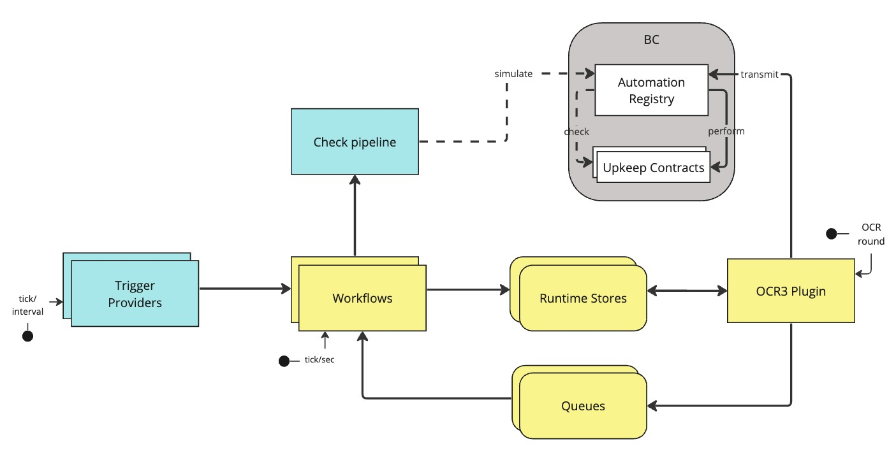

# Offchain protocol overview v2.1

This document aims to give a high level overview of the protocol for Automation `v2.1`. 

## Table of Contents

  - [Abstract](#abstract)
  - [Overview](#overview)
  - [Boundaries](#boundaries)
    - [Reliability Guarantees](#reliability-guarantees)
    - [Security Guarantees](#security-guarantees)
  - [Definitions](#definitions)
  - [Workflows](#workflows)
    - [Conditional Triggers](#1-conditional-triggers)
        - [Conditional Proposal](#conditional-proposal-workflow)
        - [Conditional Finalization](#conditional-finalization-workflow)
    - [Log Triggers](#2-log-triggers)
        - [Log Trigger](#log-trigger-workflow)
        - [Retry](#retry-workflow)
        - [Log Recovery Proposal](#log-recovery-proposal-workflow)
        - [Log Recovery Finalization](#log-recovery-finalization-workflow)
  - [Components](#components)
    - [Registry](#registry)
    - [Runner](#runner)
    - [Transmit Event Provider](#transmit-event-provider)
    - [Coordinator](#coordinator)   
    - [Result Store](#result-store)
    - [Metadata Store](#metadata-store)
    - [Observers](#observers)
        - [Proposal Observers](#proposal-observers)
        - [Finalization Observers](#finalization-observers)
    - [Log Provider](#log-provider)
    - [Log Recoverer](#log-recoverer)
    - [Upkeep States](#upkeep-states)
    - [OCR3 Plugin](#plugin)
        - [Observation](#observation)
        - [Outcome](#outcome)
        - [Reports](#reports)
        - [ShouldAcceptAttestedReport](#shouldacceptattestedreport)
        - [ShouldTransmitAcceptedReport](#shouldtransmitacceptedreport)

 

## Abstract

Chainlink Automation is a decentralized execution engine for automating smart contracts, 
with a generic and extensible triggering mechanism.

The protocol is composed of offchain components which we will discuss in this document, 
and onchain contracts.

Two types of triggers are supported:

- **Conditional triggers** - triggers that are based on on-chain conditions, e.g. a price feed update
- **Log triggers** - triggers that are based on logs emitted by external systems, e.g. a new token transfer

## Overview 

In high-level, the system works as follows:

- Upkeeps are registered through an on-chain registry.
    - Nodes sync the upkeeps to their local state.
- Nodes listen to external events, and trigger the execution of upkeeps based on those events.
- Eligible results (denoted as `performables`) with an agreement among f+1 nodes, will be performed on-chain.
- Upkeeps that will be triggered by the node rather than external events,
are considered as `proposals` and will go through additional workflow before the eligible ones become `performables`.
- The protocol runs additional threads to scan for missed events, to ensure the integrity of the system.

The offchain components are responsible for the following:

- **State management** - keeping track of the state of the system, including upkeeps, triggers, and results
- **Watching triggers** - listening to external events and triggering the execution of smart contracts based on those events
- **Eligibility workflows** - determining whether a upkeep+trigger is eligible to perform
based on on-chain check pipeline.
- **Threshold Agreement** - coming to agreement among f+1 nodes on what upkeeps are eligible to perform.
- **Execution** - executing the agreed, eligible upkeeps on-chain.

An abstracted view looks as follows:

<aside>
💡 Note: Arrows in the diagrams are directed by data flow.
</aside>
 
<aside>
💡 Note: source is available in https://miro.com/app/board/uXjVPntyh4E=/
</aside>
 

## Boundaries

The protocol works with n=10 nodes, handling upto f=2 arbitrary malicious nodes. It aims to give the following guarantees:

### Reliability Guarantees

**Log triggers** 
Out of n=10 nodes every node listens to configured user log, as soon f+1=3 nodes observe the log and agree on a checkPipeline result, it will be performed on chain. We can handle up to 7 nodes missing a log and handle capacity of upto 10 log trigger upkeeps with rate limit per upkeep of 5 logs per second.

**Conditionals** 
Every upkeep’s condition will be checked at least once by the network every ~3 seconds, handling up to f+1=3 nodes being down. Once condition is eligible, every node evaluates the checkPipeline, as soon as f+1=3 nodes agree, it will be performed on chain. We can handle capacity of up to 500 conditional upkeeps.
    
The protocol will be functional as long as > 6 ((n+f)/2) nodes are alive and participating within the p2p network (required for ocr3 consensus).

### Security Guarantees

At least f+1=3 independent nodes need to achieve agreement on an upkeep, trigger and its data before it is performed.

## Definitions

**upkeepID** 
Unique 256 bit identifier for an upkeep. Each upkeep has a unique trigger type (conditional or log) which is encoded within the ID

**trigger**
Used to represent the trigger for a particular upkeep performance, and is represented as → 
`(checkBlockNum, checkBlockHash,extension)`

The extension is based on the trigger type:
- Conditionals: no extension 
- Log triggers → `(logTxHash, logIndex, logBlockHash, logBlockNum)`. \
NOTE: `logBlockNum` might not be present in the trigger. In such cases the log block will be resolved the given block hash.

**logIdentifier**
Unique identifier for a log → `(logBlockHash, logTxHash, logIndex)`

**workID** 
Unique 256 bit identifier for a unit of work that is used across the system.

`(upkeepID, trigger)` are used to form a workID, in different structure, based on the trigger type:
- Conditionals: `keccak256(upkeepID)`. Where we allow sequential execution of the same upkeepID, in cases the trigger has a newer `checkBlockNum`, higher then the last performed check block.
- Log triggers: `keccak256(upkeepID,logIdentifier)`. At any point in time there can be at most one unit of work for a particular upkeep and log.

**upkeepPayload** 
Input information to process a unit of work for an upkeep → `(upkeepID, trigger, triggerData)`
- For conditionals triggerData is empty (derived onchain in checkUpkeep)
- For log: triggerData is the log information

**upkeepResult** 
Output information to perform an upkeep. Same for both types →  `(fastGasWei, linkNative, upkeepID, trigger, gasLimit, performData)`

## Workflows

Workflows are the sequence of events and procedures used to determine if an upkeep is considered eligible to perform.

The protocol supports two types of triggers, each brings a set of workflows:

### 1. Conditional Triggers
### Conditional Proposal Workflow

The conditional proposal workflow checks random samples of active upkeeps, 
and adds the eligibile ones to the metadata store, denoted as `proposals`.
The plugin will include them in the outcome, and they will be added in the next round to the proposal queue to be processed by the conditional finalization workflow.

<aside>
💡 Note: A node can be temporarily down and miss some rounds and associated actions on outcome. A ring buffer of coordinated proposals is kept for 20 rounds. A node can process coorindated proposals for upto last 20 rounds.

`1sec` is the expected OCR round time, so the timeout for a coordinated proposal is `~20sec`.
It gives the observe enough time to process the proposal before it gets coordinated again, on a new block number. 
</aside>

### Conditional Finalization Workflow 

The conditional finalization workflow checks coordinated proposals merged with coordinated block history, from the previous round. 
Eligible results are added to the result store, denoted as `perfomables`.

The results that were agreed by at least f+1=3 nodes will be included in a report, to be performed on chain.

### 2. Log Triggers
### Log Trigger Workflow

The log trigger workflow checks latest logs from the log event provider, and adds the eligible results to the result store, denoted as `perfomables`. Ineligible results are reported to the upkeep states store.

The results that were agreed by at least f+1=3 nodes will be included in a report, to be performed on chain.

In cases of retryable failures, the payloads are pushed into the retry queue.

### Retry Workflow

The retry workflow is used to retry payloads that failed with retryable errors. It is similar to log trigger workflow, but instead of getting logs from the log event provider, it gets payloads from the retry queue.

### Log Recovery Proposal Workflow

The log trigger workflow checks logs that were missed, and spotted by the log event recoverer.

Eligible results are added to the metadata store, denoted as `proposals`. 
Ineligible results are reported to the upkeep states store.

The plugin will include them in the outcome, and they will be added in the next round to the proposal queue to be processed by the recovery finalization workflow.

<aside>
💡 Note: A node can be temporarily down and miss some rounds and associated actions on outcome. A ring buffer of coordinated proposals is kept for 20 rounds. A node can process coorindated proposals for upto last 20 rounds.

`1sec` is the expected OCR round time, so the timeout for a coordinated proposal is `~20sec`.
It gives the observe enough time to process the proposal before it gets coordinated again, on a new block number. 
</aside>

### Log Recovery Finalization Flow

The recovery finalization workflow checks coordinated proposals merged with the latest check blocks.

Eligible results are added to the result store, denoted as `perfomables`.
Ineligible results are reported to the upkeep states store.

The results that were agreed by at least f+1=3 nodes will be included in a report, to be performed on chain.

 

## Components

An abstracted view of the common protocol components looks as follows:

<aside>
💡 Note: Arrows in the diagrams are directed by data flow.
</aside>
 
<aside>
💡 Note: source is available in https://miro.com/app/board/uXjVPntyh4E=/
</aside>
 

### Registry

This is the main component that connects the offchain node with the registry onchain.

The registry offers the following functionality:

**Upkeeps life-cycle management**

The regsitry sync the active upkeeps and corresponding config onchain with node’s local state in memory.

It does so by listening to the relevant events on chain for the following:
- Upkeep registration/cancellation/migration
- Upkeep pause/unpause
- Upkeep config changes

Periodically (~10min) does a full sync of all upkeeps onchain state so that any potential missed / reorged state logs are accounted for.

The registry calls the log event provider in case some log filter needs to be updated.
Upon startup, all upkeeps are synced from chain and the log event provider is called to update all the log filters.

**Check pipline**

The registry exposes `checkUpkeep` so the runner could execute the pipeline taking `upkeepPayload` as an input

- If the checkBlockNum is lagging latestBlock by more than a threshold (100 blocks) then it returns a non-retryable error
- For log triggers verifies the log is still part of chain at checkBlockNum
- Does a batch RPC call to checkUpkeep (for conditionals calls `checkUpkeep()` and for log calls `checkUpkeep(logData)`).
- Does batch mercury fetch and callback for upkeeps that requires mercury data
- Does batch RPC call to simulatePerformUpkeep for upkeeps that are eligible

Returns list of results for each payload. Result can be **eligible** with upkeepResult / **non-eligible** with failure reason / **error**, which can be retryable if it’s transient or non retryable e.g. in case the checkBlockNum is too old.

### Runner

This component is responsible for parallelizing upkeep executions and providing a single interface to different components maintaining a shared cache

- Takes a list of upkeepPayloads, calls CheckPipeline asynchronously with upkeeps being batched in a single pipeline execution
- Maintains in-memory cache of non-errored pipeline executions indexed on (trigger, upkeepID). Directly uses that result instead of a new execution if available
- Allows for repeated calls for the same upkeep payload
- Execution automatically fails after a timeout that was provided as argument (~10s, set by Observer)
- A call to CheckUpkeeps on the runner is synchronous. A worker is spawned per a batch of upkeeps to check, and all workers needs to finish before returning.

<aside>
💡 Note: Because of the sync nature, we don't track pending requests, so there might be double checking of same payloads. Once a payload was checked, we cache the result in memory, so next time we don't need to check it again.
</aside>

### Transmit Event Provider

This component serves to transmit events from log poller, to other components in the system (coordinator). 

**Transmit Events** 

Are emitted when a report is sent onchain to the contract.
The following events are used:

- `UpkeepPerformed`: Report successfully performed for an upkeep 
(for log triggers `(upkeepID, logIdentifier)`)
- `StateUpkeep`: Report was stale and the upkeep was already performed
    - For conditionals this happens when an upkeep is tried to be performed on a checkBockNumber which is older than the last perform block (Stale check). 
    - For log triggers this happens when the particular (upkeepID, logIdentifier) has been performed before already
- `InsufficientFunds`: Emitted when pre upkeep execution when not enough funds are found on chain for the execution. Funds check is done in checkPipeline, but actual funds required on chain at execution time can change, e.g. to gas price changes / link price changes. In such cases upkeep is not performed or charged. These reports should really be an edge case, on chain we have a multiplier during checkPipeline to overestimate funds before even attempting an upkeep.
- `CancelledUpkeep`: This happens when the upkeep gets cancelled in between check time and perform time. To protect against malicious users, the contract adds a 50 block delay to any user cancellation requests.

### Coordinator

Stores in-flight & confirmed reports in memory and helps to coordinate the execution and transmission of upkeeps across multiple components in the system.

The coordinator stores reports by workID, in case of conflict - a new report is seen for the same key, it waits on the higher `checkBlockNumber`. 

All keys stored expire after TTL. In case an item is not marked as performed within TTL, it is assumed that the tx got lost. Conditionals and Log upkeeps recover from such scenarios through different logic.

**Conditionals**

The coordinator ensures that an upkeep is performed at progressively higher blocks and tracks 'in-flight' status on transmits. This variant sets the last performed block higher in a local cache for an upkeepId on every transmit event.

The coordinator stores inflight reports per `upkeepID` and an associated `upkeepTriggerID` for identifying transmit events.

**Log Triggers**

The coordinator ensures that a triggered log is performed exactly once. It tracks 'in-flight' status when a report is generated and registers transmit events such as performed or staleReport or reorg.

The coordinator stores inflight reports per `(upkeepID, logIdentifier)` and an associated `upkeepTriggerID` for identifying transmit events.

**Transmit Events**

The coordinator listens to transmit event logs (stale / reorged / cancelled / insufficient funds) of stored `upkeepTriggerID` in memory, and act accordingly:

- Upkeep performed - the `upkeepTriggerID` is marked as confirmed
    - For log upkeeps, state is updated to `performed` with the Upkeep States component
    - For conditional upkeeps the perform block number is stored in memory
- Stale report - the `upkeepTriggerID` is marked as confirmed
    - conditional upkeeps will be sampled and checked again automatically on a later block
    - for log upkeeps it means there was a duplicate perform. The state is updated to `performed` in Upkeep States
- Reorged - the `upkeepTriggerID` is removed from coordinator
    - conditional upkeeps will be sampled and checked again automatically on a later block
    - Logs enqueued through log event provider (i.e. checkBlockNum == logBlockNum) are forgotten about since the log got reorged. If reorg causes a new log then it is expected to be surfaced up by the log provider again.
    - Logs enqueued through recovery attemtps will be picked up again by the log recoverer
- Insufficient funds - the `upkeepTriggerID` is removed
    - This can happen when we thought there were sufficient funds during checkPipeline but during onchain execution funds were not enough (e.g. gas price spike)
    - conditional upkeeps will be sampled and checked again automatically on a later block
    - Logs are expected to be picked up again by the log recoverer
- Cancelled Upkeep - the `upkeepTriggerID` is removed. No recovery is needed as upkeep is cancelled

**Coordinator API**

**Accept**

The coordinator exposes an `Accept` function to mark an upkeep as pending for transmission. It is used during `shouldAccept` step by the plugin.

**Should Transmit**

To check whether some reported upkeep can be transmitted, the plugin calls to `shouldTransmit` on the coordinator.
It expects the full trigger as input, i.e. with concrete checkBlockNum and checkBlockHash:
`shouldTransmit(upkeepID, trigger)`.

An item is considered confirmed for transmission if it was accepted by the coordinator (i.e. we expect it to be performed) but was yet transmitted.

**Should Process**

`shouldProcess(upkeepID, trigger)` is used to check whether an upkeep should be processed which is used for pre-processing / filtering to prevent duplicate reports.

For conditionals
    - False if report is inflight for upkeepID
    - False if report has been confirmed after blockNum (This can happen when network latest block is lagging this node’s logs)

For log triggers
    - False if report is inflight or has been confirmed
    - True otherwise

### Result Store

This component is responsible for storing `upkeepResults` that a node thinks should be performed. It hopes to get agreement from quorum of nodes on these results to push into reports. Best effort is made to ensure the same logs enter different node’s result stores independently as **it is assumed that blockchain nodes will get in sync within TTL**, but it is not guaranteed as node’s local blockchain can see different reorgs or select different logs during surges. Results that do not achieve agreement within TTL are expected to be picked up by recovery flow.

- Maintains an in-memory collection of upkeepResults
    - Conditional upkeeps will be stored by (upkeepID)
    - Log upkeeps will be stored by (upkeepID, logIdentifier)
    - Overwrites results for duplicated results with newer checkBlockNumber.
- Each result has a TTL (5min). When the TTL expires
    - conditional upkeeps will be sampled and checked again automatically
    - log upkeeps that were missed are expected to be picked up by the log recoverer
- Provides a read API to view results, which takes as input (`pseudoRandomSeed`, `limit`).
The nodes in the network are expected to use the same seed for a particular round. Sorts all keys (trigger, upkeepID) with the `seed` and provides first `limit` results. 
Note: We do not do FIFO here as potentially out of sync old results will block new results sent by the node for agreement.
- Provides an API to remove (trigger, upkeepID) from the store

### Metadata Store

This component stores the metadata to be sent within observations to the network. 
Every record has a TTL, and upon expiry items are just removed without any action.
The store provides an add / view / remove API for other components.

There are three categories of objects that are stored:

**1. Conditional proposals**

Are sample upkeeps (upkeepID) that are eligible to perform.

**2. Log recovery proposals**

Are recovered proposals (upkeepID, logIdentifier) that were missed, and are eligible to perform.

**3. Latest block history**

Latest block history coming from the block subscriber (last 256 block and hashes), and used for coordination among nodes.

## Observers

### Proposal Observers

Proposal observers takes input from the corresponding ticker, process it and push it into the metadata store to be incloded as proposals for the next round.

Proposals will be added to the propsal queue, be processed by the finalization observers.

There are 2 types of proposal observers:

#### 1. Samples Observer
Manages samples of conditional upkeeps, gets sample payloads from the upkeep provider.

#### 2. Recovery Observer
Manages recovery proposals of log upkeeps, gets recovery payloads from the log recoverer.

 

Proposal observers will perform the following steps:

**Pre-processing**

Filters upkeeps present in coordinator (`shouldProcess`).

**Processing**

Calls runner with upkeep payloads

**Post-processing**

Does the following:

- For eligible upkeeps, adds them to the metadata store (`eligible samples` / `recovery logs`)
- For ineligible upkeeps, updates only log trigger state in upkeep states store to be ineligible
- Retryables and other errors are ignored
    - For conditionals, they will be anyway picked up in next samples.
    - For log triggers, we expect the recoverer to pick them up again if needed

### Finalization Observers

Finalization observers takes input from the corresponding ticker, process it and push it into the result store to be to be included in reports by the plugin.

There are 4 types of finalization observers:

#### 1. Conditional Finalization
Processes agreed eligible samples from previous observations, served via the proposal queue.

#### 2. Log Trigger
Processes log triggers that were found by log provider.

#### 3. Log Recovery Finalization
Processes agreed eligible recovery logs from previous observations, served via the proposal queue.

#### 4. Retry
Processes retryable payloads from the retry queue.

 

Finalization observers will perform the following steps:

**Pre-processing**

Filters upkeeps present in coordinator (`shouldAccept`).

**Processing**

Calls runner with upkeep payloads.

**Post-processing**

Does the following:

- For eligible upkeeps, adds them to the result store
- For ineligible upkeeps, updates only log trigger state in upkeep states store to be ineligible
- Retryables errors are added to the retry queue

### Log Provider

This component’s purpose is to surface latest logs for registered upkeeps. It does not maintain any state across restarts (no DB). The main functionality it exposes

- Listening for log filter config changes from Registry: 
    - sync log poller with the filters
    - sync the local filter store with changes in filters
- Provides a simple interface `getLatestPayloads` to provide new **unseen** logs across all upkeeps within a limit
    - Repeatedly queries latest logs from the chain (via log poller DB) for the last `lookbackBlocks` (200) blocks. Stores them in the log buffer (see below)
    - Handles load balancing and rate limiting across upkeeps
    - `getLatestPayloads` limits the number of logs returned per upkeep in a single call. If there are more logs present, then the provider gives the logs starting from an offset (`latestBlock-latestBlock%lookbackBlocks`). Offset is calculated such that the nodes try to choose the same logs from big pool of logs so they can get agreement

<aside>
💡 Note: `getLatestPayloads` might miss logs when there is a surge of logs which lasts longer than `lookbackBlocks`. Upon node restarts it can **miss logs** when it restarts after a gap, or **provide same logs again** when it quickly restarts
</aside>

#### Log Buffer

A circular/ring buffer of blocks and their corresponding logs, that act as a cache for logs. It is used to store the last `lookbackBlocks` blocks, where each block holds a list of that block's logs.

Logs are marked as seen when they are returned by the buffer, to avoid working with logs that have already been seen.

It is used by the log provider to provide unkseen logs to the node.

#### Log Filter Store

A local store of log filters for each upkeep. It is used by the log provider and log recoverer as a source of truth for the current active log filters.

### Log Recoverer

The log recoverer is responsible to ensure that no logs are missed.
It does that by running a background process for re-scanning of logs and putting the ones we missed into the recovery flow (without checkBlockNum/Hash).

Logs will be considered as missed if they are older than `latestBlock - lookbackBlocks` and has not been performed or successfully checked already (ineligible result).

While the provider is scanning latest logs, the recoverer is scanning older logs in ascending order, up to `latestBlock - lookbackBlocks`, newer blocks will be under the provider's lookback window.

**Recoverer scanning process**

- The recoverer maintains a `lastRePollBlock` for each upkeep, i.e. the last block it scanned for that upkeep.
- Every second, the recoverer will scan logs for a subset of `n=10` upkeeps, where `n/2` upkeeps are randomly chosen and `n/2` upkeeps are chosen by the oldest `lastRePollBlock`.
- It will start scanning from `lastRePollBlock` on each iteration
- Logs that are older than 24hr are ignored, therefore `lastRePollBlock` starts at `latestBlock - (24hr block)` in case it was not populated before.
- Once a missed log was found, it is being added to a `visited` set, so it will not be added again. It will be removed from the `visited` set upon expiration (24h) or once it is performed / marked as ineligible.

**Proposal Data**

The recoverer provides an interface `getProposalData` to be called when buildubg an upkeep payload for a particular log on demand by giving a trigger as in input.

The payload building process does the following:
- Does not return a payload for a newer log to ensure recovery logs are isolated from latest logs. 
- Verifies that the log is part of the filters for that upkeep and it is still present on chain
- Checks whether the log has been already processed within the upkeepState. If so then doesn't return a payload
- Gets the required log from log poller
- Packs the log for the payload

### Upkeep States

The upkeeps states are used to track the status of log upkeeps (ineligible, performed) across the system, to avoid redundant work by the recoverer. Enables to select by (upkeepID, logIdentifier) is used as a key to store the state of a log upkeep.

The state is updated after ineligible check by observer.
Perform events scanner updates the states cache lazily/on-demand, by reading `DedupKeyAdded` events.

The states (only ineligible) will be persisted in DB so the latest state to be restored when the node starts up.

<aside>
💡 Note: Performed states are not persisted in DB, as they are already present in log events that are stored in DB.
</aside>
 
<aside>
💡 Note: Using a local DB might introduce inconsistencies across the nodes in the network, e.g. in case of node restarts.
</aside>

### OCR Plugin

The plugin is performing the following tasks upon OCR3 procedures:

#### Observation

Observation starts with a processing of the previous outcome:
- Remove agreed upon finalized results from result store
- For `acceptedSamples` (already bound to a trigger - latest coordinated block from the previous outcome)
    - Remove `upkeepID` from metadata store
    - Enqueue (trigger, upkeepID) into coordinated ticker
- For `acceptedRecoveryLogs` (already bound to a trigger - latest coordinated block from the previous outcome)
    - Remove from metadata store
    - Enqueue (trigger, upkeepID) into recovery finalization ticker

Then we do the following for current observation:
- Query results from result store giving seqNr as pseudoRandom seed and predefined limit. Filter results using coordinator and add them to observation
- Query from metadata store for conditional samples and recovery instructions within limits, filter using coordinator and add them to observation
- Query block history and hashes from metadata store, add them to observation

#### Outcome

- Derive latest blockNumber and blockHash, by looking on block history and using the most recent block/hash that the majority of nodes have in common. It is not added to the outcome automatically but is used below
- Any result which has f+1 agreement is added to finalized result
- All conditional samples are collected from observations within limits, deduped and filtered from existing `acceptedSamples`. These are then added to `acceptedSamples` in the outcome **bound to the current latestBlockNumber and hash**.
    - `acceptedSamples` is a ring buffer where samples are held for ~30 rounds so that they get deduped and not get bound to a new blockNumber for some rounds
- Similar behaviour as conditional samples is done for recovery logs to maintain `acceptedRecoveryLogs`

#### Reports

Takes finalised results from the outcome, package them into reports with potential batching of upkeeps.
Batching is subject to upkeep gas limit, and preconfigured reportGasLimit and gasOverheadPerUpkeep. Additionally, same upkeep ID is not batched within the same report.

For a list of upkeepResults, we only need to send one fastGasWei, linkNative to chain in the report. This is taken from the result which has the highest checkBlockNum

#### ShouldAcceptAttestedReport

Extracts [(trigger, upkeepID)] from report and adds reported upkeeps to the coordinator to be marked as inflight. Will return always true.

<aside>
💡 Note: We cannot guarantee that the same (upkeepID) / (logIdentifier, upkeepID) will not be already existing in coordinator. (e.g. node’s local chain is lagging the network). As a result we have an override behaviour where we wait on the higher checkBlockNum report.
</aside>

#### ShouldTransmitAcceptedReport

Extracts [(trigger, upkeepID)] from report filters upkeeps that were already performed using the coordinator. If any (trigger, upkeepID) is not yet confirmed then return true
