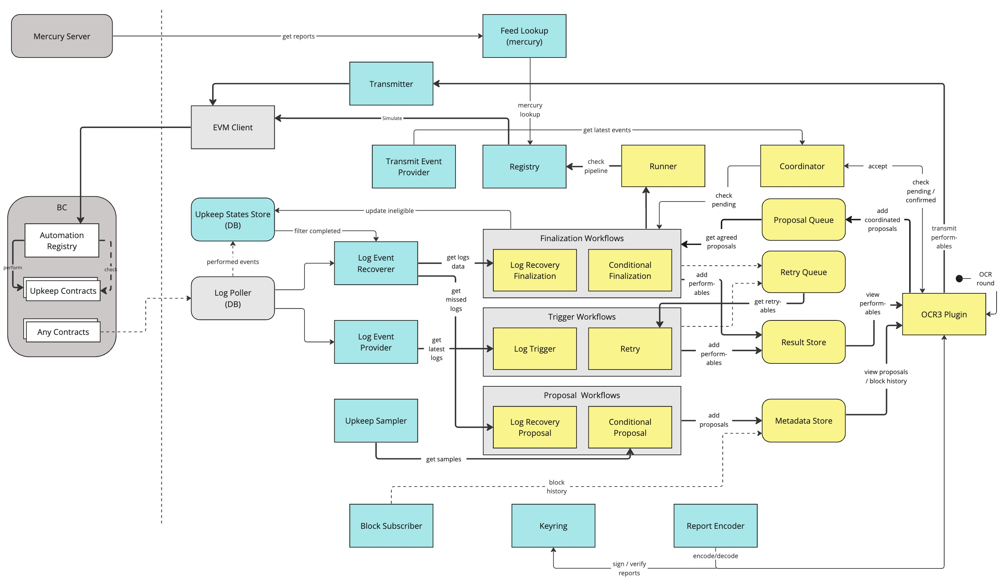

# Automation Plugin

The documents in this folder describe the architecture and design of Autmation plugin.

**Version:** `v2.1`

## Links

- [Protocol Overview](./PROTOCOL_v21.md)
- [Log Triggers](./LOG_TRIGGERS.md)
- [Diagrams Source](https://miro.com/app/board/uXjVPntyh4E=/)

## Overview

The Automation plugin is designed to provide a way to automate smart contract interaction.

The idea behind the protocol is to provide a decentralized execution engine, 
with a general infrastructure to support future triggers from other sources.

 An abstracted view of the common protocol components looks as follows:

**Plugin** process OCR3 instances in isolated thread/s, implements the interface for the OCR3 protocol.

**Ticker** provides a repeated sequence of ticks (block, time, etc.), where each tick triggers the associated observer.

**Observer** is invoked by the corresponding ticker with payloads to process, and push results into the relevant runtime store.

**Runner** parallelizes the execution pipeline for checking multiple upkeeps with their given input data.

**Coordinator** stores in-flight & confirmed reports in memory and helps to coordinate the execution of upkeeps across multiple components.

**Runtime Stores** act as a pool or queue upkeeps for the plugin.

**Registry** connects the offchain node with the registry onchain.

**Providers** watches over some trigger data source (e.g. event logs) and provides
runnable objects for the corrsponding flow.

 

