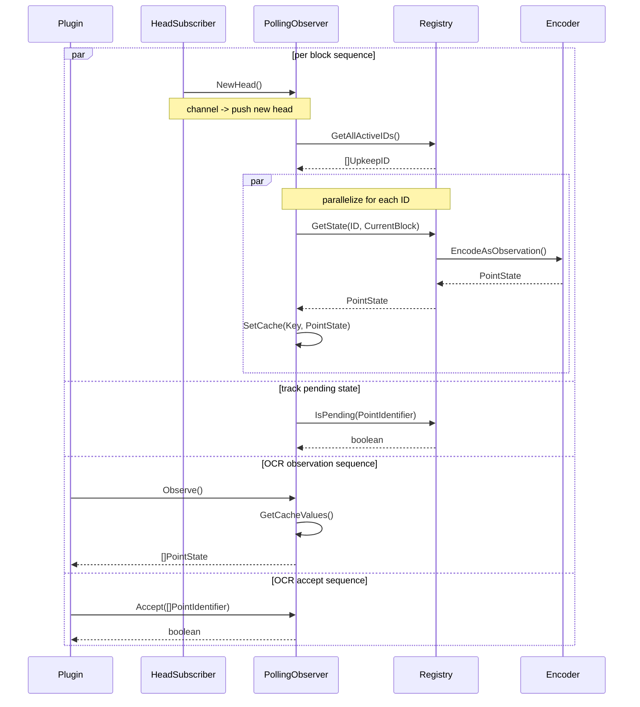

# Polling Observer Sequence Diagram

> PollingObserver implements the `Observer` interface, but details of that
> interface are not shown here.
>
> A potential attack vector is flooding a registry with eligible upkeeps. As a
> mitigation, limit the number of eligible upkeeps per head and randomly select
> them from the total set of eligible before adding them to the cache.

