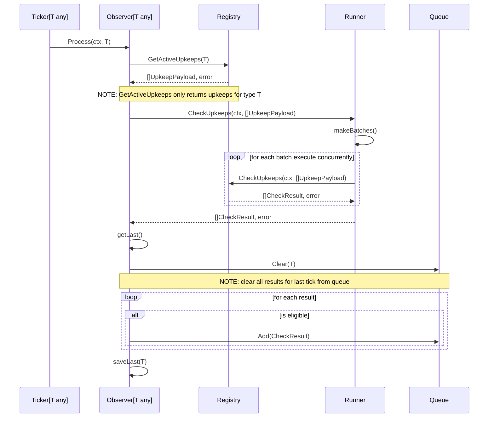

# Coordinated Ticker

```mermaid
sequenceDiagram
    participant TK as Ticker[T any]
    participant OB as Observer[T any]
    participant R as Registry
    %% TODO: participant Coordinator
    participant RN as Runner
    participant Q as Queue
    
    TK->>OB: Process(ctx, T)
    OB->>R: GetActiveUpkeeps(T)
    R-->>OB: []UpkeepPayload, error

    Note over OB,R: NOTE: GetActiveUpkeeps only returns upkeeps for type T

    OB->>RN: CheckUpkeeps(ctx, []UpkeepPayload)
    RN->>RN: makeBatches()
    loop for each batch execute concurrently
        RN->>R: CheckUpkeeps(ctx, []UpkeepPayload)
        R-->>RN: []CheckResult, error
    end
    RN-->>OB: []CheckResult, error

    OB->>OB: getLast()
    OB->>Q: Clear(T)
    Note over OB,Q: NOTE: clear all results for last tick from queue

    loop for each result
        alt is eligible
            OB->>Q: Add(CheckResult)
        end
    end

    OB->>OB: saveLast(T)
```