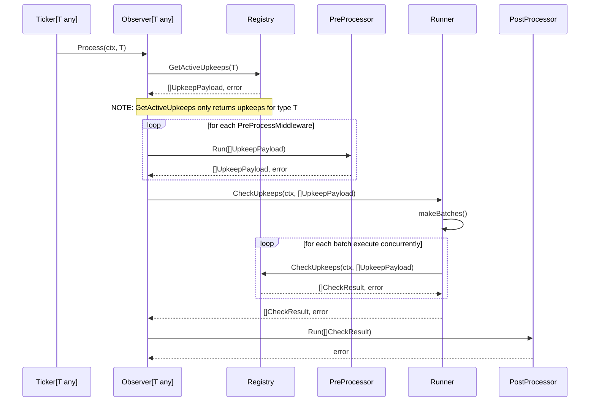

# Generic Ticker Sequence

A generic sequence applies middleware to pre-process upkeep payloads either to 
filter or modify upkeep payloads before running the check pipeline on each.
Finally, a single post-processing is applied with the array of results from the
check pipeline.

The concept of retries can also be done by routing results from the
post-processor back to the pre-processing middleware and inject them back into
the check process.

