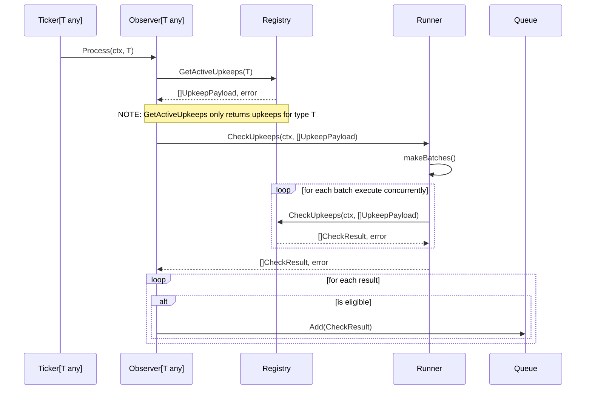

# Log Trigger

A ticker and observer are paired on ticker data type. The registry provides
upkeep data and the check pipeline. The runner provides caching and 
parallelization and has the same interface as the check pipeline. The encoder
determines eligibility and finally eligible results are added to a queue.

On startup, an observer builds a mapping of log events to upkeeps and begins
watching the registry for upkeep configuration changes or new/cancelled upkeeps.
Upkeep changes not shown in the following diagram for simplicity.

