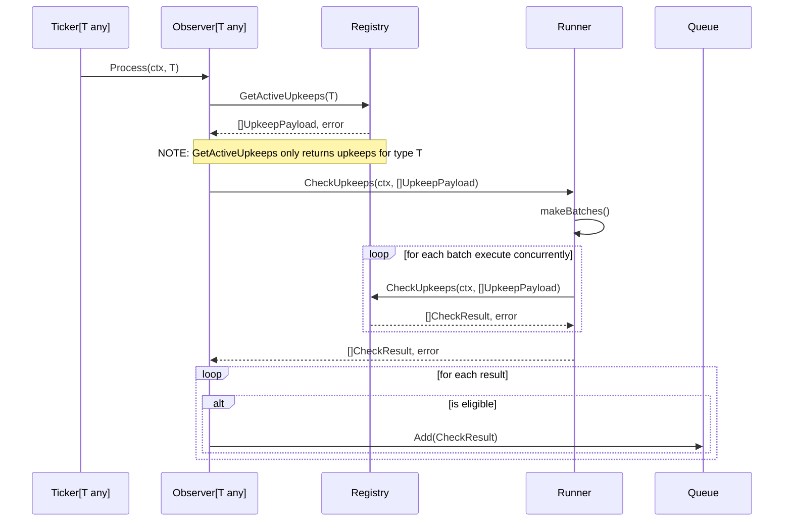

# Log Trigger

A ticker and observer are paired on ticker data type. The registry provides
upkeep data and the check pipeline. The runner provides caching and 
parallelization and has the same interface as the check pipeline. The encoder
determines eligibility and finally eligible results are added to a queue.

On startup, an observer builds a mapping of log events to upkeeps and begins
watching the registry for upkeep configuration changes or new/cancelled upkeeps.
Upkeep changes not shown in the following diagram for simplicity.

## Value Types

To maintain chain agnostic behavior, the following data types should be
abstracted from the plugin as much as possible. That is, the less detail the
plugin needs from each of the following values types, the better.

### ConfiguredUpkeep

A configured upkeep represents all information that identifies a single upkeep
as registered by the user including upkeep id, trigger configuration, 
check data, etc.

### UpkeepPayload

An upkeep payload represents all information the check pipeline requires to
check the eligibility of an upkeep and might include upkeep id, block number,
check data, etc.

This can potentially be a combination of both `ConfiguredUpkeep` and `T`:

```golang
type UpkeepPayload struct {
    // Upkeep is all information that identifies the upkeep
    Upkeep ConfiguredUpkeep
    // Tick is the event that triggered the upkeep to be checked
    Tick interface{}
}
```

### CheckResult

```golang
type CheckResult struct {
    // UpkeepPayload is the original payload request
    UpkeepPayload
    // Retryable indicates whether the result failed or not and should be retried
    Retryable bool
    // Eligible indicates whether the upkeep is performable or not
    Eligible bool
    // Data is a general container for raw results that pass through the plugin
    Data interface{}
}
```

### UpkeepResult

An upkeep result represents all information returned from the check pipeline for
a single upkeep and might include eligibility, check block, upkeep id, etc.

