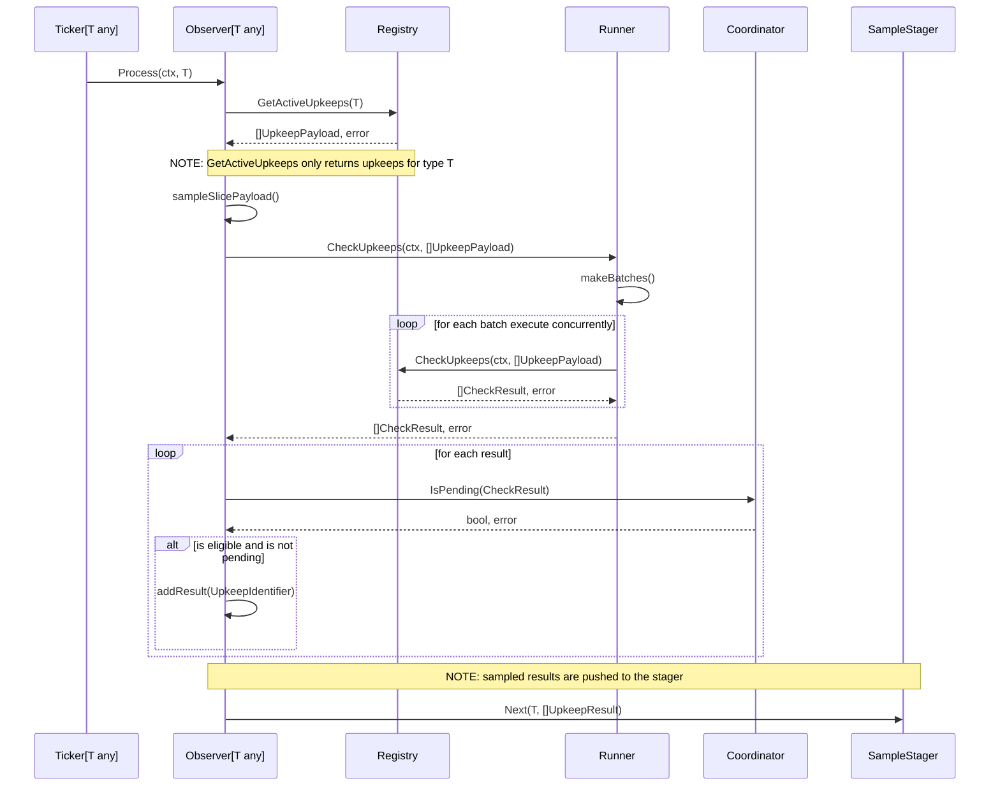

# Sampling Ticker

The sampling ticker checks a random sample of upkeeps and applies the ticker
and upkeep ids to a staging queue. The plugin pulls values from this queue to
acheive quorum on the results.

